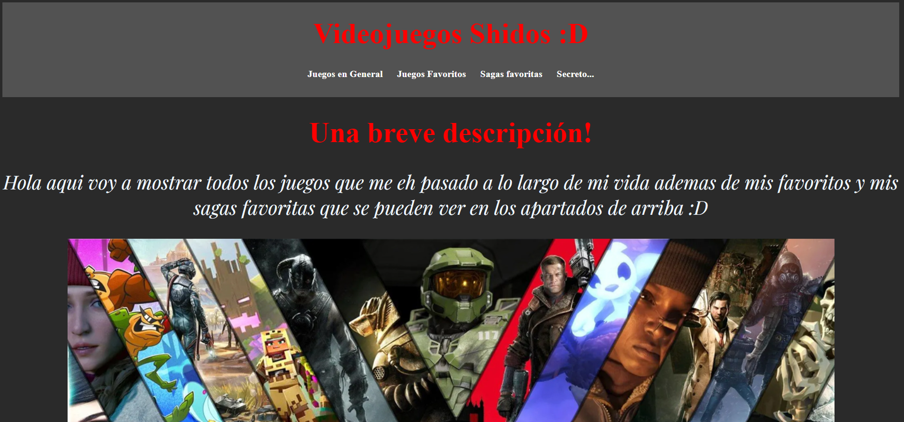
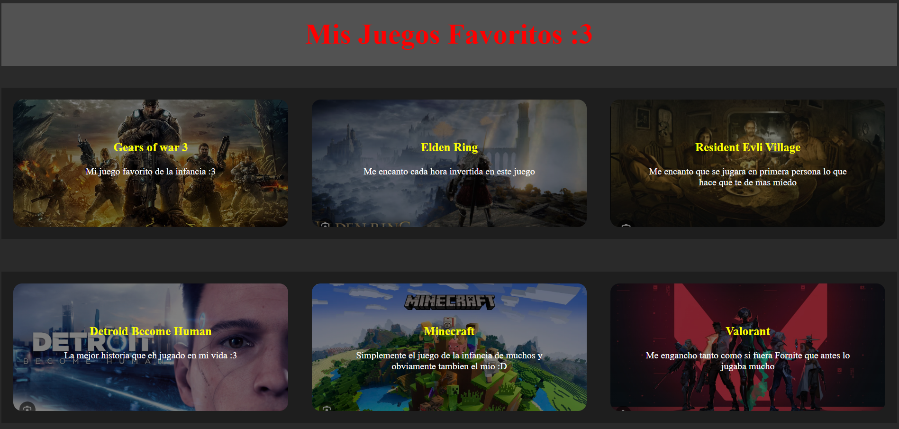
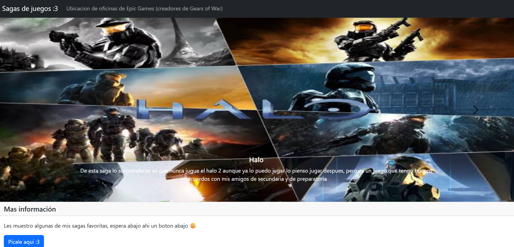
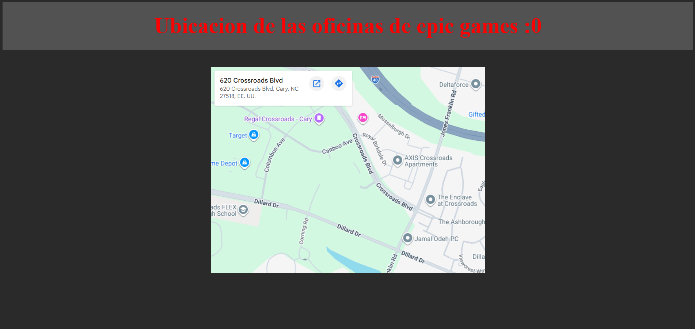

# Página web de videojuegos

Este proyecto es una pequeña página web estática creada para mostrar una colección personal de videojuegos, favoritos, sagas preferidas y un apartado secreto con un formulario de acceso.

## Capturas de pantalla

### Pagina inicial

### Pagina de juegos favoritos

### Pagina de sagas favoritas

### Pagina de mapa embebido

## ¿Qué incluye?

- Página principal con una descripción personal.
- Sección de juegos en general.
- Sección de juegos favoritos.
- Sección de sagas favoritas con carrusel y modal.
- Página de acceso secreta con validación básica de usuario y contraseña.
- Página oculta con un video de ejemplo.

## Estructura del proyecto

- index.html: página principal.
- juegos_general.html: listado de juegos en general.
- juegos_favoritos.html: listado de juegos favoritos.
- sagas_favoritas.html: sección con carrusel y contenido interactivo.
- login.html: formulario de inicio de sesión.
- pagina_secreta.html: contenido reservado accesible tras iniciar sesión.
- mapa_google.html: enlace a la ubicación de oficinas de Epic Games.
- CSS/: archivos de estilos.
- JS/validacion.js: lógica de validación del formulario.
- Imagenes/: recursos visuales del sitio.
- Video/: archivos multimedia.

## Tecnologías utilizadas

- HTML5
- CSS3
- JavaScript
- Bootstrap (para el carrusel y componentes interactivos)

## Cómo ejecutar el proyecto

1. Descarga o clona este repositorio.
2. Abre la carpeta en tu navegador.
3. Ejecuta el archivo index.html.

## Credenciales de acceso (apartado secreto)

- Usuario: Carlos
- Contraseña: 456214

## Nota

Este es un proyecto sencillo, educativo y de estilo personal, pensado como una práctica de desarrollo web estático.

## Autor

Juan Gaeta
